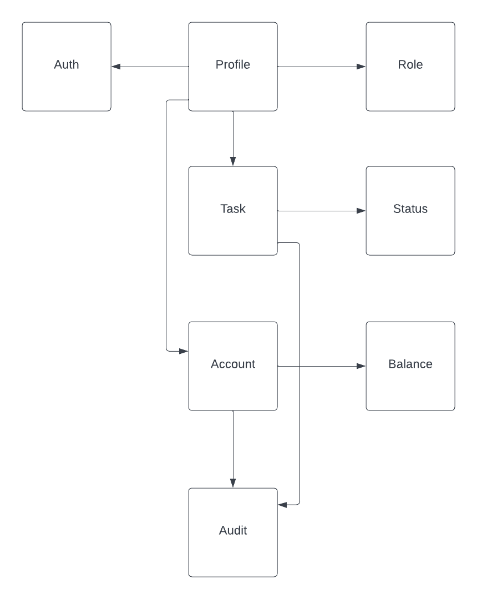
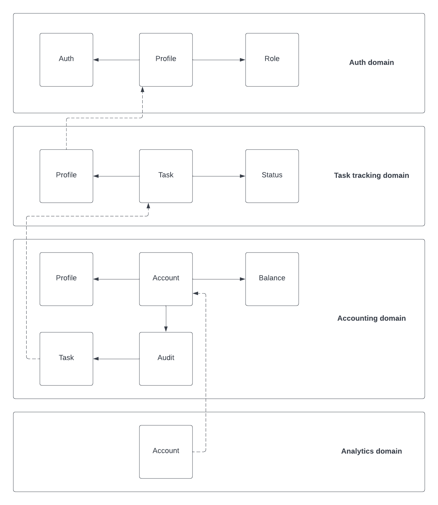
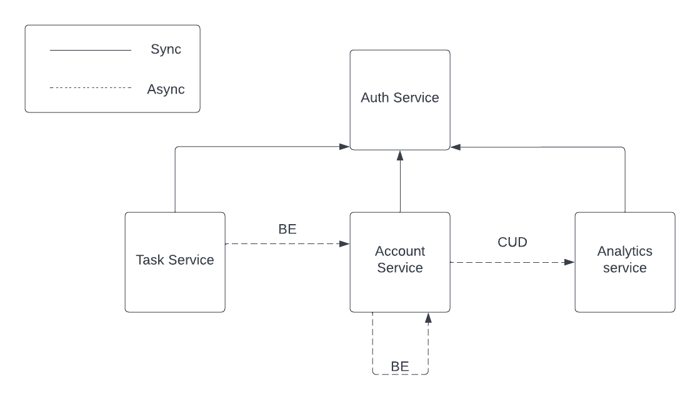

##Разбор требований на составляющие
### Auth domain:
**Требование**: Авторизация в каждом дашборде должна выполняться через общий сервис авторизации
- Actor - Profile
- Command - Log in
- Data - auth data
- Event - 

### Task domain:
**Требование**: Новые таски может создавать кто угодно (администратор, начальник, разработчик, менеджер и любая другая роль). У задачи должны быть описание, статус (выполнена или нет) и попуг, на которого заассайнена задача.
- Actor - Profile
- Command - Add task
- Data - Task
- Event - TaskAdded, TaskAssigned

**Требование**: Менеджеры или администраторы должны иметь кнопку «заассайнить задачи», которая возьмёт все открытые задачи и рандомно заассайнит каждую на любого из сотрудников (кроме менеджера и администратора)
- Actor - Profile
- Command - Assign tasks
- Data -
- Event - TaskAssigned

**Требование**: Каждый сотрудник должен иметь возможность видеть в отдельном месте список заассайненных на него задач + отметить задачу выполненной.
- Actor - Profile
- Command - Complete task
- Data - task id
- Event - TaskCompleted

### Accounting domain:
**Требование**: цены на задачу определяется единоразово, в момент появления в системе
- Actor - TaskAdded event
- Command - Caclulate task prices
- Data - task id
- Event - TaskPriceCalculated

**Требование**: У каждого из сотрудников должен быть свой счёт, который показывает, сколько за сегодня он получил денег. У счёта должен быть аудитлог того, за что были списаны или начислены деньги, с подробным описанием каждой из задач.
- Actor - TaskAssigned, TaskCompleted, PayoutPerformed events
- Command - Update account
- Data - task id, task prices, profile id, task details
- Event - AccountUpdated

**Требование**: Аккаунтинг Дешборд должен выводить количество заработанных топ-менеджментом за сегодня денег
- Actor - AccountUpdated event
- Command - Update revenue
- Data - amount, operation type
- Event -

**Требование**: В конце дня необходимо считать сколько денег сотрудник получил за рабочий день и отправлять на почту сумму выплаты
- Actor - Scheduler
- Command - Payout
- Data - payout date
- Event - PayoutPerformed

### Analytics domain:
**Требование**: Нужно указывать, сколько заработал топ-менеджмент за сегодня и сколько попугов ушло в минус.
- Actor - AccountUpdated event
- Command - Update stats
- Data - amount, operation type, profile id
- Event -

**Требование**: Нужно показывать самую дорогую задачу за день, неделю или месяц. Cамой дорогой задачей является задача с наивысшей ценой из списка всех закрытых задач за определенный период времени
- Actor - AccountUpdated event
- Command - Update most expensive task
- Data - task id, amount, task details, completedAt, operation type
- Event -

## Модель данных

## Домены

## Сервисы

##Events
### Business Events
- `TaskAdded`

  **producer**: Task Service, **consumer**: Account Service

- `TaskAssigned`

  **producer**: Task Service, **consumer**: Account Service

- `TaskCompleted`

  **producer**: Task Service, **consumer**: Account Service

- `PayoutPerformed`

  **producer**: Account Service, **consumer**: Account Service

### CUD:
- `AccountUpdated`

  **producer**: Account Service, **consumer**: Analytics Service

Data:
* task id,
* task details,
* completedAt,
* operation type,
* amount
* profile id

